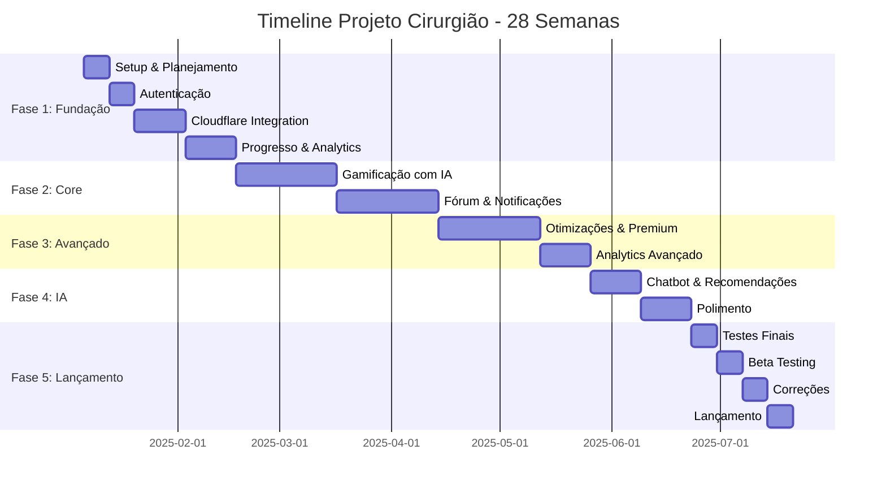

# 📊 RESUMO EXECUTIVO - TIMELINE PROJETO CIRURGIÃO

## 🎯 VISÃO GERAL

Este documento fornece uma visão consolidada da timeline de 28 semanas do Projeto Cirurgião, servindo como guia rápido para consulta e planejamento.

---

## 📅 CRONOGRAMA MACRO

---

## 👥 MATRIZ RACI - RESPONSABILIDADES

### Legenda
- **R** = Responsible (Responsável pela execução)
- **A** = Accountable (Aprovador final)
- **C** = Consulted (Consultado)
- **I** = Informed (Informado)

| Feature/Atividade | PO-01 | TECH-LEAD | BACKEND | DEVOPS | IOS | ANDROID | MOBILE-PLENO | FRONTEND | DESIGNER | QA |
|-------------------|-------|-----------|---------|--------|-----|---------|--------------|----------|----------|-----|
| **Planejamento** | A | R | C | C | C | C | I | C | C | C |
| **Arquitetura** | C | A | R | R | C | C | I | C | I | I |
| **Design System** | C | C | I | I | I | I | I | I | A/R | I |
