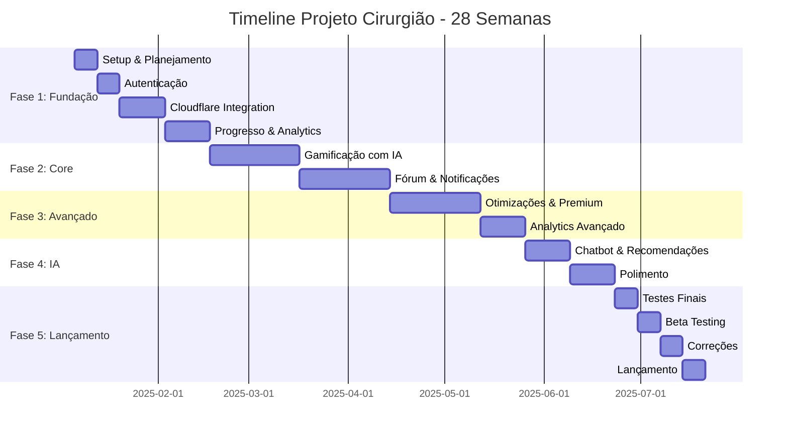
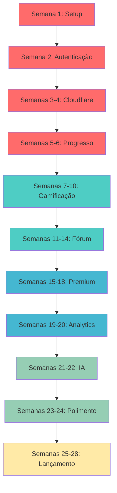

# 📊 RESUMO EXECUTIVO - TIMELINE PROJETO CIRURGIÃO

## 🎯 VISÃO GERAL

Este documento fornece uma visão consolidada da timeline de 28 semanas do Projeto Cirurgião, servindo como guia rápido para consulta e planejamento.

---

## 📅 CRONOGRAMA MACRO



---

## 👥 MATRIZ RACI - RESPONSABILIDADES

### Legenda
- **R** = Responsible (Responsável pela execução)
- **A** = Accountable (Aprovador final)
- **C** = Consulted (Consultado)
- **I** = Informed (Informado)

| Feature/Atividade | PO-01 | TECH-LEAD | BACKEND | DEVOPS | IOS | ANDROID | MOBILE-PLENO | FRONTEND | DESIGNER | QA |
|-------------------|-------|-----------|---------|--------|-----|---------|--------------|----------|----------|-----|
| **Planejamento** | A | R | C | C | C | C | I | C | C | C |
| **Arquitetura** | C | A | R | R | C | C | I | C | I | I |
| **Design System** | C | C | I | I | I | I | I | I | A/R | I |
| **Autenticação Backend** | I | A | R | C | I | I | I | I | I | C |
| **Autenticação Frontend** | I | A | C | I | C | C | C | R | C | C |
| **Autenticação Mobile** | I | A | C | I | R | R | C | I | C | C |
| **Cloudflare Integration** | C | A | R | R | I | I | I | I | I | C |
| **Dashboard Admin** | A | C | R | C | I | I | I | R | R | C |
| **Video Player** | C | A | R | C | R | R | C | R | C | C |
| **Gamificação** | A | C | R | I | R | R | C | R | R | C |
| **IA/Chatbot** | C | A | R | C | C | C | I | C | I | C |
| **Fórum** | A | C | R | I | R | R | C | R | C | C |
| **Push Notifications** | C | A | R | R | R | R | C | C | I | C |
| **Analytics** | A | C | R | R | C | C | I | R | C | C |
| **Assinaturas** | A | C | R | C | R | R | C | R | C | C |
| **Testes** | C | A | C | C | C | C | C | C | I | R |
| **Deploy** | C | A | C | R | I | I | I | I | I | C |

---

## 📈 DISTRIBUIÇÃO DE CARGA POR AGENTE

### Semanas 1-6 (Fase 1: Fundação)
```
PO-01:           ████████░░░░░░░░░░░░ 40%
TECH-LEAD-01:    ████████████████████ 100%
BACKEND-01:      ████████████████████ 100%
DEVOPS-01:       ████████████████████ 100%
IOS-01:          ████████████████░░░░ 80%
ANDROID-01:      ████████████████░░░░ 80%
MOBILE-PLENO:    ████████░░░░░░░░░░░░ 40%
FRONTEND-01:     ████████████████░░░░ 80%
DESIGNER-01:     ████████████████████ 100%
QA-01:           ████████░░░░░░░░░░░░ 40%
```

### Semanas 7-14 (Fase 2: Core)
```
PO-01:           ████████░░░░░░░░░░░░ 40%
TECH-LEAD-01:    ████████████████░░░░ 80%
BACKEND-01:      ████████████████████ 100%
DEVOPS-01:       ████████████░░░░░░░░ 60%
IOS-01:          ████████████████████ 100%
ANDROID-01:      ████████████████████ 100%
MOBILE-PLENO:    ████████████████░░░░ 80%
FRONTEND-01:     ████████████████████ 100%
DESIGNER-01:     ████████████████████ 100%
QA-01:           ████████████████░░░░ 80%
```

### Semanas 15-24 (Fases 3-4: Avançado & IA)
```
PO-01:           ████████████░░░░░░░░ 60%
TECH-LEAD-01:    ████████████████░░░░ 80%
BACKEND-01:      ████████████████████ 100%
DEVOPS-01:       ████████████████░░░░ 80%
IOS-01:          ████████████████████ 100%
ANDROID-01:      ████████████████████ 100%
MOBILE-PLENO:    ████████████░░░░░░░░ 60%
FRONTEND-01:     ████████████████████ 100%
DESIGNER-01:     ████████████████░░░░ 80%
QA-01:           ████████████████░░░░ 80%
```

### Semanas 25-28 (Fase 5: Lançamento)
```
PO-01:           ████████████████████ 100%
TECH-LEAD-01:    ████████████████████ 100%
BACKEND-01:      ████████████░░░░░░░░ 60%
DEVOPS-01:       ████████████████████ 100%
IOS-01:          ████████████░░░░░░░░ 60%
ANDROID-01:      ████████████░░░░░░░░ 60%
MOBILE-PLENO:    ████████░░░░░░░░░░░░ 40%
FRONTEND-01:     ████████████░░░░░░░░ 60%
DESIGNER-01:     ████████░░░░░░░░░░░░ 40%
QA-01:           ████████████████████ 100%
```

---

## 🎯 ENTREGAS PRINCIPAIS POR FASE

### FASE 1: FUNDAÇÃO (Semanas 1-6)
**Objetivo:** Estabelecer base sólida do projeto

| Semana | Entregas Principais | Agentes Principais |
|--------|---------------------|-------------------|
| 1 | Arquitetura, Design System, Setup Infraestrutura | Todos |
| 2 | Autenticação JWT, Telas de Login, Permissões | BACKEND, FRONTEND, MOBILE, DESIGNER |
| 3-4 | Cloudflare Stream/R2, Dashboard Admin, Upload Vídeos | BACKEND, DEVOPS, FRONTEND, DESIGNER |
| 5-6 | Sistema de Progresso, Analytics (Cloudflare + BigQuery) | BACKEND, FRONTEND, DEVOPS |

**Critérios de Sucesso:**
- ✅ Infraestrutura GCP + Cloudflare configurada
- ✅ Autenticação funcionando em todas plataformas
- ✅ Upload e streaming de vídeos operacional
- ✅ Dashboard admin funcional
- ✅ Analytics básico implementado

---

### FASE 2: DESENVOLVIMENTO CORE (Semanas 7-14)
**Objetivo:** Implementar features MUST-HAVE

| Semana | Entregas Principais | Agentes Principais |
|--------|---------------------|-------------------|
| 7-10 | Gamificação (XP, Níveis, Conquistas), IA Personalização | BACKEND, FRONTEND, MOBILE, DESIGNER |
| 11-14 | Fórum, Push Notifications, Sistema Reputação | BACKEND, FRONTEND, MOBILE, DEVOPS |

**Critérios de Sucesso:**
- ✅ Sistema de gamificação estilo Duolingo
- ✅ IA gerando desafios personalizados
- ✅ Fórum com posts/respostas funcionando
- ✅ Push notifications configuradas
- ✅ Leaderboard em tempo real

---

### FASE 3: RECURSOS AVANÇADOS (Semanas 15-20)
**Objetivo:** Otimizar e adicionar recursos premium

| Semana | Entregas Principais | Agentes Principais |
|--------|---------------------|-------------------|
| 15-18 | Otimizações, Cache, Assinaturas, Download Offline | BACKEND, MOBILE, DEVOPS |
| 19-20 | Analytics Avançado, Relatórios, Exportação | BACKEND, FRONTEND |

**Critérios de Sucesso:**
- ✅ Performance otimizada (< 100ms queries)
- ✅ Sistema de assinaturas funcionando
- ✅ Download offline (mobile)
- ✅ Dashboard analytics avançado
- ✅ Exportação de relatórios (CSV/PDF)

---

### FASE 4: IA E PREMIUM (Semanas 21-24)
**Objetivo:** Recursos de IA e preparação para lançamento

| Semana | Entregas Principais | Agentes Principais |
|--------|---------------------|-------------------|
| 21-22 | Chatbot IA, Recomendações, Busca Inteligente | BACKEND, FRONTEND, MOBILE |
| 23-24 | Polimento UX, Correções, Preparação Marketing | Todos |

**Critérios de Sucesso:**
- ✅ Chatbot IA respondendo perguntas
- ✅ Sistema de recomendações personalizado
- ✅ Busca inteligente funcionando
- ✅ UX polida em todas plataformas
- ✅ Materiais de marketing prontos

---

### FASE 5: TESTES E LANÇAMENTO (Semanas 25-28)
**Objetivo:** Validar e lançar produto

| Semana | Entregas Principais | Agentes Principais |
|--------|---------------------|-------------------|
| 25 | Testes de Carga, Segurança, Auto-scaling | QA, DEVOPS |
| 26 | Beta Testing, Coleta Feedback | PO, Todos |
| 27 | Correções Finais, Testes Regressão | Todos |
| 28 | Deploy Produção, Monitoramento, Lançamento | DEVOPS, PO, Todos |

**Critérios de Sucesso:**
- ✅ Uptime > 99.9%
- ✅ Tempo resposta < 200ms
- ✅ Crash-free rate > 99.5%
- ✅ 0 bugs críticos
- ✅ Produto em produção

---

## 🔄 FLUXO DE DEPENDÊNCIAS



---

## 📊 MÉTRICAS DE ACOMPANHAMENTO

### Métricas Semanais

| Métrica | Target | Medição |
|---------|--------|---------|
| **Velocity** | 40-50 story points/sprint | Jira |
| **Code Coverage** | > 80% | Coverage reports |
| **PR Review Time** | < 24h | GitHub/GitLab |
| **Bug Resolution Time** | < 48h (críticos) | Jira |
| **Deploy Frequency** | Daily | CI/CD logs |

### Métricas de Qualidade

| Métrica | Target | Fase |
|---------|--------|------|
| **Unit Tests** | > 80% coverage | Todas |
| **Integration Tests** | > 70% coverage | Fase 2+ |
| **E2E Tests** | 100% critical paths | Fase 3+ |
| **Load Tests** | 1000 concurrent users | Fase 5 |
| **Security Audit** | 0 vulnerabilidades críticas | Fase 5 |

### Métricas de Performance

| Métrica | Target | Quando Medir |
|---------|--------|--------------|
| **API Response Time** | < 100ms (p95) | Fase 3+ |
| **Page Load Time** | < 2s | Fase 3+ |
| **Video Start Time** | < 3s | Fase 1+ |
| **App Launch Time** | < 2s | Fase 3+ |
| **Crash-Free Rate** | > 99.5% | Fase 4+ |

---

## 🚨 RISCOS E MITIGAÇÕES

### Riscos Técnicos

| Risco | Probabilidade | Impacto | Mitigação |
|-------|---------------|---------|-----------|
| **Custo Cloudflare excede orçamento** | Média | Alto | Implementar cache agressivo, monitorar uso |
| **Performance de IA lenta** | Média | Médio | Cache de respostas, rate limiting |
| **Problemas de sincronização offline** | Alta | Médio | Testes extensivos, conflict resolution |
| **Escalabilidade do banco** | Baixa | Alto | Read replicas, sharding planejado |
| **Integração pagamentos complexa** | Média | Alto | Sandbox testing, documentação detalhada |

### Riscos de Projeto

| Risco | Probabilidade | Impacto | Mitigação |
|-------|---------------|---------|-----------|
| **Atraso em entregas** | Média | Alto | Buffer de 10% no cronograma |
| **Mudança de escopo** | Alta | Alto | Change control process rigoroso |
| **Dependência entre times** | Alta | Médio | Daily standups, comunicação clara |
| **Qualidade comprometida** | Baixa | Alto | Code review obrigatório, QA contínuo |
| **Burnout da equipe** | Média | Alto | Monitorar carga, distribuir trabalho |

---

## 📋 CHECKLIST DE LANÇAMENTO

### 2 Semanas Antes (Semana 26)
- [ ] Beta testing iniciado
- [ ] Feedback coletado e priorizado
- [ ] Infraestrutura de produção configurada
- [ ] Monitoramento e alertas ativos
- [ ] Documentação completa
- [ ] Materiais de marketing prontos

### 1 Semana Antes (Semana 27)
- [ ] Todos os bugs críticos corrigidos
- [ ] Testes de regressão passando
- [ ] Testes de carga bem-sucedidos
- [ ] Plano de rollback documentado
- [ ] Equipe de suporte treinada
- [ ] Comunicação com stakeholders

### Dia do Lançamento (Semana 28)
- [ ] Deploy para produção executado
- [ ] Smoke tests passando
- [ ] Monitoramento ativo
- [ ] Equipe em standby
- [ ] Comunicado de lançamento enviado
- [ ] Métricas sendo coletadas

### Pós-Lançamento
- [ ] Monitorar métricas por 48h
- [ ] Coletar feedback inicial
- [ ] Resolver incidentes rapidamente
- [ ] Retrospectiva de lançamento
- [ ] Planejar próximas iterações

---

## 🎯 PRÓXIMOS PASSOS PÓS-LANÇAMENTO

### Semanas 29-32 (Mês 1 Pós-Lançamento)
- Monitoramento intensivo
- Correção de bugs reportados
- Coleta de feedback de usuários
- Ajustes de performance
- Iterações rápidas

### Meses 2-3 Pós-Lançamento
- Análise de métricas de uso
- Implementação de melhorias baseadas em feedback
- Novas features secundárias
- Otimizações contínuas
- Expansão de conteúdo

### Roadmap Futuro
- Integração com wearables
- Realidade aumentada para cirurgias
- Certificações oficiais
- Parcerias com instituições
- Expansão internacional

---

## 📞 CONTATOS E RECURSOS

### Documentação
- **Timeline Completa:** `TIMELINE_PROJETO_CIRURGIAO.md` + `TIMELINE_PROJETO_CIRURGIAO_PARTE2.md`
- **Orquestração:** `MAESTRO_ORQUESTRACAO_EQUIPE.md`
- **Agentes:** Pasta `/agents/` (10 arquivos .md)
- **Arquitetura:** `/docs/architecture/`

### Ferramentas
- **Gestão:** Jira/Linear
- **Código:** GitHub/GitLab
- **CI/CD:** GitHub Actions
- **Monitoramento:** Grafana + Prometheus
- **Comunicação:** Slack/Teams

### Reuniões Recorrentes
- **Daily Standup:** 9h, 15min, todos os dias
- **Sprint Planning:** Segunda, 9h, 2h
- **Sprint Review:** Sexta, 14h, 1h
- **Sprint Retrospective:** Sexta, 15h, 1h
- **Tech Sync:** Quarta, 14h, 1h

---

## ✅ CONCLUSÃO

Esta timeline de 28 semanas foi cuidadosamente planejada para entregar um produto completo e de alta qualidade. O sucesso depende de:

1. **Comunicação clara** entre todos os agentes
2. **Execução disciplinada** seguindo a timeline
3. **Qualidade** nunca comprometida
4. **Flexibilidade** para ajustes quando necessário
5. **Foco** nas features MUST-HAVE

**Lembre-se:** Este documento é um guia vivo. Ajustes podem ser necessários, mas sempre com aprovação do PO-01 e TECH-LEAD-01.

---

**Última Atualização:** 08/11/2025  
**Versão:** 1.0  
**Status:** Aprovado para Execução
